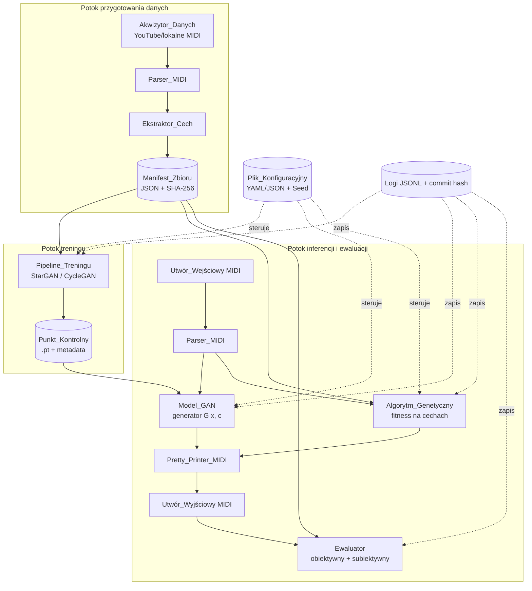
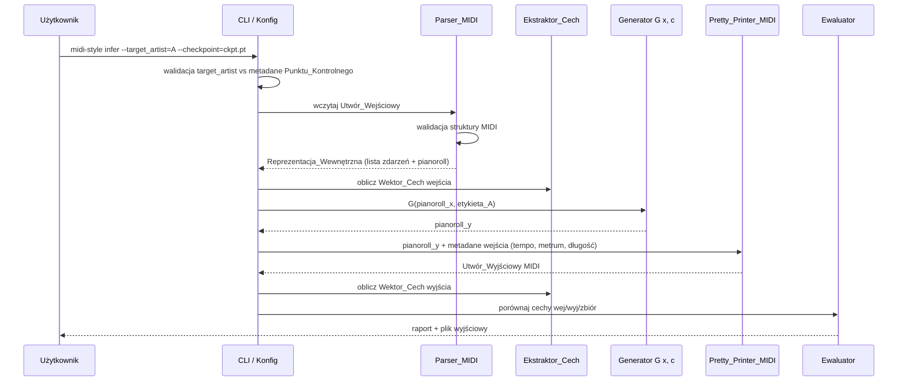

# Design Document

## Introduction

Niniejszy dokument opisuje projekt techniczny *Systemu* modelowania stylu artystycznego muzyków, realizowanego jako praca inżynierska. Dokument stanowi rozwinięcie wymagań zdefiniowanych w pliku `requirements.md` i przedstawia architekturę, komponenty, modele danych, projekt sieci generatywnej (CycleGAN/StarGAN), projekt *Algorytmu_Genetycznego*, projekt parsera MIDI, potok ewaluacji oraz realizację właściwości poprawnościowych.

Zgodnie z konwencją dokumentu wymagań, nagłówki strukturalne (Overview, Architecture, Components and Interfaces, Data Models, Correctness Properties, Error Handling, Testing Strategy) zachowano w języku angielskim, natomiast treść merytoryczna prowadzona jest w języku polskim.

## Overview

### Cel projektu technicznego

*System* przyjmuje na wejściu *Zbiór_Stylu* (kolekcja plików MIDI artysty docelowego) oraz *Utwór_Wejściowy* (pojedynczy plik MIDI), a generuje *Utwór_Wyjściowy* w formacie MIDI o cechach stylistycznych przesuniętych w kierunku artysty docelowego, przy zachowaniu czasowej i metrycznej struktury wejścia.

Realizacja transferu odbywa się dwoma równoległymi metodami:

1. **Metoda generatywna (*Model_GAN*)** - sieć neuronowa typu CycleGAN/StarGAN trenowana na pianorollach wyekstraktowanych z *Zbiorów_Stylu*. Tryb domyślny to *Model_GAN_Warunkowany* (StarGAN, jeden generator G(x, c) dla N artystów); tryb fallback to *Model_GAN_Per_Artysta* (osobny CycleGAN dla pojedynczego artysty).
2. **Metoda ewolucyjna (*Algorytm_Genetyczny*)** - optymalizacja niskowymiarowego wektora transformacji *Utworu_Wejściowego* (transpozycja, gęstość rytmiczna, długość nut) w oparciu o *Funkcję_Dopasowania* mierzącą odległość *Wektora_Cech* od agregowanego wektora *Zbioru_Stylu*.

Obie metody są dostępne niezależnie i mogą być uruchamiane równolegle w celu porównania wyników w ewaluacji obiektywnej i subiektywnej.

### Założenia projektowe

- Reprezentacja symboliczna (MIDI) zamiast surowego audio - kompromis pomiędzy jakością merytoryczną a ograniczonymi zasobami obliczeniowymi (pojedynczy *GPU_Konsumencki*, 16 GB RAM).
- Język implementacji: Python 3.10+ (jeden ekosystem dla ML, MIDI i analizy statystycznej).
- Framework uczenia głębokiego: PyTorch (zgodnie z tradycją prac z reprezentacją symboliczną - [arXiv:1809.07575](https://arxiv.org/abs/1809.07575)).
- Reprodukowalność jako wymóg pierwszej klasy (Wymaganie 8): wszystkie generatory liczb pseudolosowych są inicjalizowane *Seedem* z pliku konfiguracyjnego.
- Testowalność jako wymóg pierwszej klasy (Wymaganie 11): kluczowe komponenty (parser MIDI, *Ekstraktor_Cech*, *Algorytm_Genetyczny*) projektowane są pod kątem property-based testing.

### Decyzje projektowe i ich uzasadnienie

| Decyzja | Uzasadnienie |
|---|---|
| StarGAN jako tryb domyślny zamiast N niezależnych CycleGAN | Brunner et al. (2018) pokazują, że CycleGAN działa na pianorollach, ale dla N artystów wymaga N modeli. StarGAN (Choi et al., 2018) pozwala obsłużyć wielu artystów jednym modelem dzięki *Etykiecie_Artysty* c, zmniejszając wymagania pamięciowe i czas treningu. |
| Pianoroll jako reprezentacja wewnętrzna *Modelu_GAN* | Standard w literaturze symbolicznego transferu stylu ([1809.07575](https://arxiv.org/abs/1809.07575), MidiNet, MuseGAN). Naturalnie pasuje do konwolucji 2D. |
| Lista zdarzeń (event list) jako reprezentacja wewnętrzna parsera | Pianoroll traci informacje o velocity, kanałach i zdarzeniach meta. Lista zdarzeń pozwala spełnić własność round-trip (Wymaganie 11.1). Pianoroll jest pochodną listy zdarzeń, używaną wyłącznie wewnątrz *Modelu_GAN*. |
| *Algorytm_Genetyczny* jako równoległa metoda transferu | Zgodnie z metodyką Kowalczuk et al. (2017) - metoda ewolucyjna nie wymaga treningu, działa od razu na nowym artyście, stanowi merytoryczny punkt odniesienia dla *Modelu_GAN* i pozwala porównać dwa paradygmaty w pracy. |
| Parametry rzeczywiste (nie macierz pianoroll) jako genotyp w *Algorytmie_Genetycznym* | Niskowymiarowy genotyp (transpozycja, gęstość, długość nut) jest interpretowalny muzycznie i pozwala zachować strukturę *Utworu_Wejściowego* (Wymaganie 5.6, 5.7). Optymalizacja całego pianorolla byłaby równoważna treningowi *Modelu_GAN* i zatraciłaby kontrast metodyczny. |
| FluidSynth + standardowy SoundFont do renderowania audio | Wymaganie 7.2 - ujednolicona konfiguracja syntezatora dla testów odsłuchowych. FluidSynth jest open-source i deterministyczny. |

## Architecture

### Architektura wysokopoziomowa

System składa się z siedmiu współpracujących komponentów logicznych zorganizowanych w trzy potoki:

- **Potok przygotowania danych**: *Akwizytor_Danych* → *Parser_MIDI* → *Ekstraktor_Cech* → *Manifest_Zbioru*.
- **Potok treningu**: *Manifest_Zbioru* → *Pipeline_Treningu* → *Punkt_Kontrolny*.
- **Potok inferencji i ewaluacji**: *Utwór_Wejściowy* → (*Model_GAN* | *Algorytm_Genetyczny*) → *Pretty_Printer_MIDI* → *Ewaluator*.



### Diagram przepływu inferencji warunkowanej



### Wybory technologiczne

| Warstwa | Technologia | Uzasadnienie |
|---|---|---|
| Język | Python 3.10+ | Standard w środowisku ML, MIDI (mido, pretty_midi) i analizie statystycznej (scipy, statsmodels). |
| Framework ML | PyTorch ≥ 2.0 | Dynamiczny graf, prosta serializacja *Punktów_Kontrolnych*, wsparcie dla CPU i CUDA. |
| Biblioteka MIDI | `mido` (parsing niskopoziomowy) + `pretty_midi` (analiza wysokopoziomowa) | Komplementarność: `mido` daje pełną kontrolę nad zdarzeniami (potrzebną dla round-trip), `pretty_midi` upraszcza obliczenia tempo/key. |
| Konwersja audio | `FluidSynth` + SoundFont GM (np. FluidR3_GM) | Wymaganie 7.2 - ujednolicony syntezator. Open-source, deterministyczny. |
| Algorytm genetyczny | `DEAP` lub własna implementacja na NumPy | DEAP jest dojrzały, ale dla pełnej kontroli nad determinizmem (Wymaganie 11.4) preferowana jest własna implementacja na seedowanym `numpy.random.Generator`. |
| Konfiguracja | YAML + JSON (oba akceptowane, parser `pyyaml`) | Wymaganie 8.1. |
| Logowanie | `structlog` z formatterem JSON-lines | Wymaganie 8.4 (format strukturalny). |
| Property-based testing | `Hypothesis` | De facto standard dla PBT w Python; dobra integracja z pytest, strategie shrinkingu. |
| Testy statystyczne | `scipy.stats` (`ttest_rel`, `wilcoxon`) | Wymaganie 6.3. |
| Wersja kodu | `git rev-parse HEAD` zapisywane w katalogu wynikowym | Wymaganie 8.2. |

### Struktura katalogów projektu

```
musicians_style/
├── pyproject.toml
├── requirements.txt              # Wymaganie 8.5
├── environment.yml
├── configs/
│   ├── default_conditional.yaml
│   ├── default_per_artist.yaml
│   └── default_ga.yaml
├── src/musicians_style/
│   ├── data/                     # Akwizytor_Danych, Manifest_Zbioru
│   ├── midi/                     # Parser_MIDI, Pretty_Printer_MIDI
│   ├── features/                 # Ekstraktor_Cech
│   ├── models/
│   │   ├── stargan.py            # Model_GAN_Warunkowany
│   │   ├── cyclegan.py           # Model_GAN_Per_Artysta
│   │   └── losses.py
│   ├── training/                 # Pipeline_Treningu
│   ├── ga/                       # Algorytm_Genetyczny
│   ├── inference/                # transfer stylu
│   ├── evaluation/               # ewaluacja obiektywna i subiektywna
│   └── cli.py
├── tests/
│   ├── unit/
│   ├── property/                 # testy Hypothesis (Wymaganie 11)
│   └── integration/
├── experiments/                  # katalogi wynikowe per uruchomienie
└── thesis/                       # Dokument_Dyplomowy (LaTeX, wybrana klasa dokumentu)
```

## Components and Interfaces

### Akwizytor_Danych

**Odpowiedzialność**: pobranie *Zbioru_Stylu* z lokalnego katalogu lub z YouTube (zgodnie z Wymaganiem 1.6, fragmenty ≤ 15 s) oraz utworzenie *Manifestu_Zbioru*.

**Interfejs**:

```python
class DatasetAcquirer:
    def acquire_local(self, directory: Path) -> Manifest: ...
    def acquire_youtube(self, ids: list[str], max_duration_s: int = 15) -> Manifest: ...
    def validate(self, manifest: Manifest) -> ValidationReport: ...
```

**Walidacja** (Wymagania 1.2-1.5):
- Liczba poprawnych plików < 30 → ostrzeżenie w logu.
- Plik niezgodny z SMF → pominięcie + log.
- Czas trwania spoza [5 s, 30 min] → odrzucenie + log.
- Liczba poprawnych plików = 0 → wyjątek `EmptyDatasetError` i niezerowy kod wyjścia.

**Manifest_Zbioru** (Wymaganie 1.7) jest plikiem JSON:

```json
{
  "artist_id": "the_beatles",
  "files": [
    {"path": "yesterday.mid", "sha256": "...", "duration_s": 124.3, "tracks": 4, "source": "local"}
  ],
  "created_at": "2025-01-15T12:00:00Z",
  "git_commit": "a1b2c3d"
}
```

### Parser_MIDI i Pretty_Printer_MIDI

**Odpowiedzialność**: dwukierunkowa konwersja pomiędzy plikiem MIDI a *Reprezentacją_Wewnętrzną*. Komponenty centralne dla własności round-trip (Wymaganie 5.4, 11.1).

**Interfejs**:

```python
@dataclass(frozen=True)
class NoteEvent:
    tick: int          # czas w tickach SMF
    channel: int       # 0..15
    pitch: int         # 0..127
    velocity: int      # 0..127, 0 oznacza note-off
    duration_ticks: int

@dataclass(frozen=True)
class MetaEvent:
    tick: int
    kind: Literal["tempo", "time_signature", "key_signature", "program_change"]
    payload: dict[str, Any]

@dataclass(frozen=True)
class InternalRepr:
    ticks_per_beat: int
    notes: tuple[NoteEvent, ...]    # posortowane stabilnie po (tick, channel, pitch)
    meta: tuple[MetaEvent, ...]
    smf_format: int                 # 0 lub 1

class MidiParser:
    def parse(self, path: Path) -> InternalRepr: ...
    def parse_bytes(self, data: bytes) -> InternalRepr: ...
    def validate(self, path: Path) -> None:
        """Wymaganie 5.5: walidacja przed jakimkolwiek przetwarzaniem treści."""

class MidiPrettyPrinter:
    def write(self, repr_: InternalRepr, path: Path) -> None: ...
    def to_bytes(self, repr_: InternalRepr) -> bytes: ...
```

**Kluczowe decyzje**:

- `notes` i `meta` są krotkami (immutable), co ułatwia porównywanie i hashowanie - kluczowe dla testów własności.
- Sortowanie zdarzeń o identycznym `tick` jest deterministyczne (lex po `(tick, channel, pitch, velocity)`), co spełnia wymóg „semantycznej równoważności z dokładnością do kolejności zdarzeń o identycznym znaczniku czasu" (Wymaganie 5.4).
- Walidacja struktury (`validate`) wykonywana jest na surowych bajtach przed próbą obliczenia długości czasowej (Wymaganie 5.5), a komunikat błędu jest zawsze niepusty - jeśli nie da się wskazać miejsca, używana jest stała `"wykryto uszkodzenie struktury pliku"`.

**Pianoroll** (pomocnicza reprezentacja dla *Modelu_GAN*):

```python
class Pianoroll:
    """Macierz binarna [czas × wysokość], step = 16th note (zgodnie z 1809.07575)."""
    def from_internal(self, repr_: InternalRepr, window_steps: int = 64) -> np.ndarray: ...
    def to_internal(self, pianoroll: np.ndarray, template: InternalRepr) -> InternalRepr:
        """Rekonstrukcja używa metadanych template (tempo, metrum) - Wymaganie 5.7."""
```

Konwersja `Pianoroll → InternalRepr` jest stratna (traci velocity i kanały MIDI), dlatego w inferencji *template* zachowujący te informacje pochodzi z *Utworu_Wejściowego*.

### Ekstraktor_Cech

**Odpowiedzialność**: obliczenie *Wektora_Cech* o stałej długości z *Reprezentacji_Wewnętrznej* (Wymaganie 2).

**Interfejs**:

```python
@dataclass(frozen=True)
class FeatureVector:
    tempo_bpm: float                       # > 0
    key: str                               # np. "C major", "A minor"
    pitch_class_histogram: np.ndarray      # shape (12,), suma = 1
    interval_histogram: np.ndarray         # shape (25,), interwały -12..+12 + brak
    note_density_per_s: float              # ≥ 0
    mean_note_duration_s: float            # ≥ 0
    std_note_duration_s: float             # ≥ 0
    rest_ratio: float                      # ∈ [0, 1]

class FeatureExtractor:
    def extract(self, repr_: InternalRepr) -> FeatureVector: ...
    def extract_dataset(self, manifest: Manifest) -> AggregatedFeatures: ...

@dataclass(frozen=True)
class AggregatedFeatures:
    mean: FeatureVector
    median: FeatureVector
    std: FeatureVector
    covariance: np.ndarray   # do odległości Mahalanobisa (Wymaganie 4.3)
```

**Algorytmy**:

- Tonacja: profil korelacji Krumhansla-Schmucklera (zgodnie z [Mahieu, *Detecting Musical Key with Supervised Learning*](Literatura/Mahieu-DetectingMusicalKeyWithSupervisedLearning-report.pdf) i podstawami z [*Understanding Basic Music Theory*](Literatura/Understanding%20Basic%20Music%20Theory%20%28%20PDFDrive%20%29.pdf)).
- Tempo: jeśli plik nie zawiera meta-zdarzenia tempo → 120 BPM + log (Wymaganie 2.2).
- Histogram klas wysokości: zliczanie wystąpień nut modulo 12, normalizacja do sumy 1.
- Histogram interwałów: różnice pomiędzy kolejnymi nutami w monofonicznym śladzie melodycznym (najwyższa nuta w danym kroku czasowym).
- Pliki puste / wyłącznie pauzy: zwracany jest `NEUTRAL_FEATURE_VECTOR` zdefiniowany jako stała w `features/constants.py` (Wymagania 2.7, 11.8).

**Determinizm** (Wymaganie 2.4): wszystkie operacje są czysto numeryczne, brak zewnętrznego stanu. Wielokrotne wywołanie `extract` dla tej samej `InternalRepr` zwraca bit-identyczny wektor.

### Model_GAN

#### Model_GAN_Warunkowany (StarGAN)

**Architektura** (na podstawie Choi et al., *StarGAN*, 2018, zaadaptowana do pianorolli zgodnie z [arXiv:1809.07575](https://arxiv.org/abs/1809.07575)):

- **Generator G(x, c)**:
  - Wejście: pianoroll `x ∈ {0,1}^{T×P}` (T = 64 kroki, P = 84 wysokości od C1 do B7) skonkatenowany po kanałach z mapą *Etykiety_Artysty* `c ∈ {0,1}^N`.
  - Down-sampling: 2 warstwy Conv2D (stride 2) + InstanceNorm + ReLU.
  - Bottleneck: 6 bloków residualnych.
  - Up-sampling: 2 warstwy ConvTranspose2D + InstanceNorm + ReLU.
  - Wyjście: warstwa Conv2D + sigmoid (binarny pianoroll).
- **Dyskryminator D(x)**:
  - PatchGAN 70×70 (5 warstw Conv2D, LeakyReLU 0.2).
  - Dwie głowice wyjściowe:
    - `D_src(x)` - prawdopodobieństwo, że `x` pochodzi z prawdziwych danych.
    - `D_cls(x)` - klasyfikacja artysty (logity nad N klasami).

**Funkcje straty** (Wymaganie 3.12):

- *Adversarial loss*: `L_adv = E[log D_src(x_real)] + E[log(1 - D_src(G(x, c)))]` (lub Wasserstein-GP zgodnie z [1809.07575](https://arxiv.org/abs/1809.07575)).
- *Domain classification loss*:
  - dla rzeczywistych: `L_cls_real = -E[log D_cls(c_real | x_real)]`.
  - dla generowanych: `L_cls_fake = -E[log D_cls(c | G(x, c))]`.
- *Cycle consistency loss*: `L_cyc = E[||G(G(x, c), c_orig) - x||_1]`.
- *Identity loss*: `L_id = E[||G(x, c_orig) - x||_1]` (opcjonalna, stabilizuje trening).
- Łącznie: `L = L_adv + λ_cls * L_cls + λ_cyc * L_cyc + λ_id * L_id`, gdzie λ_cls = 1, λ_cyc = 10, λ_id = 5 (wartości z [1809.07575](https://arxiv.org/abs/1809.07575)).

#### Model_GAN_Per_Artysta (CycleGAN)

Tryb fallback (Wymaganie 3.13). Dwa generatory `G_AB` i `G_BA` oraz dwa dyskryminatory `D_A`, `D_B`. Architektura warstwowa identyczna jak generator/dyskryminator powyżej, lecz bez warunkowania na *Etykiecie_Artysty* i bez głowicy `D_cls`. Strata: `L_adv + λ_cyc * L_cyc + λ_id * L_id`.

**Interfejs**:

```python
class StarGANGenerator(nn.Module):
    def forward(self, x: Tensor, c: Tensor) -> Tensor: ...

class StarGANDiscriminator(nn.Module):
    def forward(self, x: Tensor) -> tuple[Tensor, Tensor]:  # (D_src, D_cls)
        ...

class CycleGANGenerator(nn.Module):
    def forward(self, x: Tensor) -> Tensor: ...

class GANTrainer:
    def __init__(self, config: TrainConfig, mode: Literal["conditional", "per_artist"]): ...
    def train(self, manifest: Manifest | MultiArtistManifest, seed: int) -> Path:
        """Zwraca ścieżkę do ostatniego Punktu_Kontrolnego."""
    def resume(self, checkpoint_path: Path) -> Path: ...
```

**Punkt_Kontrolny** (Wymagania 3.4, 3.14) - słownik PyTorch zapisywany jako `.pt`:

```python
{
  "epoch": int,
  "generator_state": dict,
  "discriminator_state": dict,
  "optimizer_state": dict,
  "rng_states": {"torch": ..., "numpy": ..., "python": ...},
  "metadata": {
      "mode": "conditional" | "per_artist",
      "artists": ["beatles", "queen", "abba"],   # mapowanie pozycja → identyfikator
      "model_version": "1.0",
      "train_config_hash": "..."
  }
}
```

**OOM handling** (Wymaganie 3.9): `try/except torch.cuda.OutOfMemoryError` w pętli treningu - log + sugerowany batch size + `sys.exit(2)`.

### Algorytm_Genetyczny

**Genotyp** (Wymaganie 4.1):

```python
@dataclass(frozen=True)
class Genome:
    transpose_semitones: float        # zaokrąglane do int przy aplikacji, zakres [-12, +12]
    rhythm_density_factor: float      # ∈ [0.5, 2.0], 1.0 = bez zmian
    note_duration_factor: float       # ∈ [0.5, 2.0]
    velocity_offset: float            # ∈ [-32, +32]
    # parametry mogą przyjmować wartości ujemne (transformacje odwrotne)
```

Genotyp jest niskowymiarowy (4 parametry rzeczywiste) - zapewnia interpretowalność muzyczną i pozwala zachować strukturę *Utworu_Wejściowego*.

**Operatory** (Wymaganie 4.2):

- *Selekcja turniejowa* o rozmiarze k = 3 (parametryzowalna).
- *Krzyżowanie*: jednopunktowe lub jednorodne (BLX-α dla parametrów rzeczywistych z α = 0.5).
- *Mutacja gaussowska*: `gene' = gene + N(0, σ_gene)`, σ ustawiane per-parametr w konfiguracji.
- *Elitaryzm*: opcjonalny (Wymaganie 4.7); k_elite najlepszych osobników przechodzi bezpośrednio do następnego pokolenia.

**Funkcja_Dopasowania** (Wymaganie 4.3):

```python
def fitness(genome: Genome, x_input: InternalRepr,
            target_aggregated: AggregatedFeatures,
            metric: Literal["euclidean", "mahalanobis"]) -> float:
    transformed = apply_transformation(x_input, genome)
    feature_vec = extractor.extract(transformed)
    if metric == "euclidean":
        d = euclidean(feature_vec.as_array(), target_aggregated.mean.as_array())
    else:
        d = mahalanobis(feature_vec.as_array(), target_aggregated.mean.as_array(),
                        target_aggregated.covariance)
    return -d   # maksymalizujemy dopasowanie, minimalizujemy odległość
```

**Determinizm** (Wymaganie 4.4, 11.4): jedyny generator losowości to `numpy.random.Generator(seed)` przekazywany jako parametr; wszystkie operatory korzystają wyłącznie z niego. Nie używa się globalnego RNG.

**Warunki stopu** (Wymaganie 4.5):
- Osiągnięto `max_generations`.
- Stagnacja: brak poprawy najlepszego dopasowania przez `stagnation_generations`.

**Logowanie** (Wymaganie 4.6): w każdym pokoleniu zapisywane są `(best_fitness, mean_fitness, worst_fitness, best_genome)` w pliku JSONL.

**Interfejs**:

```python
class GeneticAlgorithm:
    def run(self, x_input: InternalRepr,
            style_aggregated: AggregatedFeatures,
            config: GAConfig, seed: int) -> tuple[Genome, History]: ...

def apply_transformation(x: InternalRepr, g: Genome) -> InternalRepr:
    """Aplikuje genotyp jako transformację MIDI - czysta funkcja."""
```

### Pipeline inferencji

```python
class StyleTransferPipeline:
    def __init__(self, config: InferenceConfig): ...

    def infer_gan(self, x_path: Path, target_artist: str,
                  checkpoint_path: Path, seed: int | None) -> Path:
        """Wymagania 5.1, 5.8-5.10."""

    def infer_ga(self, x_path: Path, target_artist: str,
                 style_manifest_path: Path, seed: int) -> Path:
        """Wymaganie 5.11."""

    def infer_combined(self, x_path: Path, ...) -> Path:
        """Wymaganie 5.1 - łączne wykorzystanie GAN + GA."""
```

Walidacja `target_artist`:
1. Wczytaj metadane *Punktu_Kontrolnego*.
2. Jeśli `mode == "conditional"` i `target_artist not in metadata.artists` → `UnknownArtistError(available=metadata.artists)` + exit 2 (Wymaganie 5.9).
3. Jeśli `mode == "per_artist"` i `target_artist != metadata.artists[0]` → `ArtistMismatchError` + exit 2 (Wymaganie 5.10).

### Ewaluator

**Ewaluacja obiektywna** (Wymaganie 6):

```python
class ObjectiveEvaluator:
    def evaluate(self, pairs: list[tuple[Path, Path]],     # (input, output)
                 style_aggregated: AggregatedFeatures) -> EvaluationReport: ...

@dataclass
class EvaluationReport:
    distances_to_style_before: list[float]
    distances_to_style_after: list[float]
    distances_input_output: list[float]
    statistical_test: StatTestResult | None  # None gdy n < 10
    plots: list[Path]                         # PDF/EPS - Wymaganie 6.6
```

Reguła doboru testu statystycznego (Wymaganie 6.3-6.4):
- `n_pairs ≥ 10`: test t-Studenta dla prób zależnych (jeśli różnice mają rozkład bliski normalnemu wg testu Shapiro-Wilka), w przeciwnym razie test rang Wilcoxona; α = 0,05.
- `n_pairs < 10`: pominięcie testu, log ostrzeżenia, raport tylko statystyk opisowych.

**Ewaluacja subiektywna** (Wymaganie 7):

```python
class SubjectiveEvaluator:
    def prepare_listening_set(self, n_pairs: int = 10) -> ListeningSet: ...
    def render_to_audio(self, midi_path: Path, soundfont: Path,
                        clip_seconds: int = 15) -> Path: ...
    def build_form(self, listening_set: ListeningSet,
                   form_type: Literal["ABX", "MOS"]) -> FormSpec: ...
    def analyze_responses(self, responses: list[Response]) -> SubjectiveReport: ...
```

## Data Models

### Plik konfiguracyjny

Schemat YAML / JSON (Wymagania 8.1, 8.6):

```yaml
seed: 42
experiment_name: "beatles_stargan_v1"

dataset:
  artists:
    beatles: "data/midi/beatles/"
    queen: "data/midi/queen/"
    abba: "data/midi/abba/"
  min_files_per_artist: 30
  max_duration_s: 1800
  min_duration_s: 5

features:
  pitch_range: [24, 108]      # C1..C8
  interval_window: 12
  pianoroll_steps_per_beat: 4

model:
  mode: "conditional"          # "conditional" | "per_artist"
  artists: ["beatles", "queen", "abba"]   # wymagane dla "conditional"
  reference_artist: null        # tylko dla "per_artist"
  pianoroll:
    window_steps: 64
    pitch_range: [24, 108]
  generator:
    n_residual_blocks: 6
  discriminator:
    type: "patchgan"
    patch_size: 70
  loss_weights:
    cls: 1.0
    cycle: 10.0
    identity: 5.0

training:
  epochs: 200
  batch_size: 16
  learning_rate: 0.0002
  optimizer: "adam"
  beta1: 0.5
  beta2: 0.999
  device: "cuda"               # "cuda" | "cpu"

ga:
  population_size: 100
  generations: 200
  tournament_size: 3
  crossover: "uniform"          # "single_point" | "uniform"
  mutation_sigma:
    transpose_semitones: 1.5
    rhythm_density_factor: 0.1
    note_duration_factor: 0.1
    velocity_offset: 5.0
  elitism_k: 2
  fitness_metric: "euclidean"   # "euclidean" | "mahalanobis"
  stagnation_generations: 30

evaluation:
  significance_alpha: 0.05
  min_pairs_for_test: 10
  plot_format: "pdf"             # "pdf" | "eps"
  soundfont: "soundfonts/FluidR3_GM.sf2"
  clip_seconds: 15
```

### Format Punktu_Kontrolnego (`.pt`)

```python
{
    "epoch": 47,
    "generator_state": OrderedDict,           # state_dict generatora
    "discriminator_state": OrderedDict,       # state_dict dyskryminatora
    "optimizer_g_state": dict,
    "optimizer_d_state": dict,
    "rng_states": {
        "torch_cpu": ByteTensor,
        "torch_cuda": list[ByteTensor],
        "numpy": dict,                         # state_dict generatora numpy
        "python": tuple,                       # random.getstate()
    },
    "metadata": {
        "mode": "conditional",                 # "conditional" | "per_artist"
        "artists": ["beatles", "queen", "abba"],
        "config_hash": "sha256:...",
        "git_commit": "a1b2c3d4",
        "model_version": "1.0",
        "created_at": "2025-03-10T12:00:00Z",
    },
    "history": {
        "loss_g": [...],
        "loss_d": [...],
        "loss_cls": [...],
        "loss_cyc": [...],
    }
}
```

### Format manifestu eksperymentu

Każdy eksperyment tworzy katalog `experiments/{experiment_name}_{timestamp}/`:

```
experiments/beatles_stargan_v1_2025-03-10_120000/
├── config_used.yaml          # kopia konfiguracji - Wymaganie 8.2
├── git_commit.txt            # commit hash - Wymaganie 8.2
├── checkpoints/
│   ├── epoch_001.pt
│   └── epoch_200.pt
├── logs/
│   ├── train.jsonl           # logi treningu - Wymaganie 8.4
│   ├── eval.jsonl
│   └── ga.jsonl
├── outputs/
│   ├── transferred/*.mid     # Utwory_Wyjściowe
│   └── audio/*.wav            # rendering FluidSynth
├── reports/
│   ├── objective_report.json
│   ├── subjective_report.json
│   ├── plots/*.pdf            # Wymaganie 6.6
│   └── statistical_tests.csv
└── manifest_used.json         # snapshot manifestu - Wymaganie 1.7
```

### Format wpisu logu (JSONL)

```json
{"ts": "2025-03-10T12:00:01.234Z", "level": "INFO", "component": "trainer", "epoch": 1, "iter": 100, "loss_g": 1.234, "loss_d": 0.987, "msg": "epoch progress"}
{"ts": "2025-03-10T12:00:05.111Z", "level": "WARNING", "component": "acquirer", "file": "broken.mid", "reason": "invalid SMF header", "msg": "file rejected"}
```

### Tabela mapowania wymagania → komponenty

| Wymaganie | Główne komponenty realizujące |
|---|---|
| 1 - Pozyskiwanie zbioru | Akwizytor_Danych, Manifest_Zbioru |
| 2 - Ekstrakcja cech | Ekstraktor_Cech, FeatureVector, AggregatedFeatures |
| 3 - Trening GAN | StarGAN/CycleGAN, GANTrainer, Pipeline_Treningu |
| 4 - Algorytm genetyczny | GeneticAlgorithm, Genome, fitness, apply_transformation |
| 5 - Transfer i parser | Parser_MIDI, Pretty_Printer_MIDI, StyleTransferPipeline |
| 6 - Ewaluacja obiektywna | ObjectiveEvaluator, EvaluationReport |
| 7 - Ewaluacja subiektywna | SubjectiveEvaluator, FluidSynth wrapper |
| 8 - Reprodukowalność | KonfigLoader, structlog, snapshoty git/config |
| 9 - Zasoby | konfiguracja `device`, profilowanie pamięci VRAM |
| 10 - Dokument dyplomowy | LaTeX (wybrana klasa dokumentu), pipeline tabel/wykresów |
| 11 - Właściwości poprawnościowe | Hypothesis testy w `tests/property/` |


## Correctness Properties

*Właściwość poprawnościowa (correctness property) to charakterystyka lub zachowanie, które powinno zachodzić we wszystkich poprawnych wykonaniach Systemu - jest to formalne stwierdzenie tego, co System ma robić. Właściwości stanowią pomost pomiędzy specyfikacją czytelną dla człowieka a maszynowo weryfikowalnymi gwarancjami poprawności.*

Poniższe właściwości zostały wyłonione z analizy prework (klasyfikacja PROPERTY/EDGE_CASE) i poddane refleksji eliminującej redundancje. Każda właściwość jest uniwersalnie kwantyfikowana ("dla każdego", "for any") i odnosi się do konkretnych kryteriów akceptacji z `requirements.md`.

### Property 1: Round-trip parsera i pretty printera MIDI

*For any* poprawnej *Reprezentacji_Wewnętrznej* `r`, sekwencja operacji `parse(write(r))` produkuje *Reprezentację_Wewnętrzną* `r'` semantycznie równoważną `r`, to znaczy zawierającą tę samą listę zdarzeń nutowych z dokładnością do kolejności zdarzeń o identycznym znaczniku czasu.

**Validates: Requirements 5.4, 11.1**

### Property 2: Idempotencja Ekstraktora_Cech

*For any* poprawnej *Reprezentacji_Wewnętrznej* `r`, dwukrotne wywołanie `extract(r)` zwraca dwa bit-identyczne *Wektory_Cech*.

**Validates: Requirements 2.4, 11.2**

### Property 3: Walidność Wektora_Cech

*For any* poprawnej *Reprezentacji_Wewnętrznej* `r`, *Wektor_Cech* `extract(r)` spełnia wszystkie poniższe niezmienniki łącznie: `tempo_bpm` jest ściśle dodatnie, `rest_ratio ∈ [0, 1]`, suma `pitch_class_histogram` wynosi 1 (z tolerancją 1e-9), długość spłaszczonego wektora cech jest stała (niezależna od długości wejścia).

**Validates: Requirements 2.1, 2.3**

### Property 4: Wektor neutralny dla pustych plików MIDI

*For any* poprawnej *Reprezentacji_Wewnętrznej* `r` o zerowej liczbie nut (`len(r.notes) == 0`), `extract(r)` zwraca dokładnie stałą `NEUTRAL_FEATURE_VECTOR` zdefiniowaną w `features/constants.py`, bez zgłaszania wyjątku.

**Validates: Requirements 2.7, 11.8**

### Property 5: Niezmienność Ekstraktora_Cech na transformację tożsamościową

*For any* poprawnej *Reprezentacji_Wewnętrznej* `r`, *Wektor_Cech* `extract(apply_transformation(r, identity_genome))` jest identyczny z `extract(r)`, gdzie `identity_genome = Genome(transpose=0, rhythm_density_factor=1.0, note_duration_factor=1.0, velocity_offset=0.0)`.

**Validates: Requirements 11.7**

### Property 6: Równoważność transpozycji

*For any* poprawnej *Reprezentacji_Wewnętrznej* `r` i każdej liczby całkowitej `k ∈ [-12, +12]`, histogram klas wysokości dźwięków `extract(transpose(r, k)).pitch_class_histogram` jest cyklicznym przesunięciem `extract(r).pitch_class_histogram` o `k` pozycji modulo 12.

**Validates: Requirements 11.3**

### Property 7: Determinizm Algorytmu_Genetycznego

*For any* ustalonego *Seed* `s`, *Utworu_Wejściowego* `x`, *Zbioru_Stylu* `D` i konfiguracji GA `c`, dwa niezależne uruchomienia `GA.run(x, D, c, seed=s)` produkują bit-identyczne populacje końcowe i bit-identyczne historie dopasowania.

**Validates: Requirements 4.4, 11.4**

### Property 8: Monotoniczność Algorytmu_Genetycznego w trybie elitaryzmu

*For any* uruchomienia `GA.run(...)` z `elitism_k ≥ 1`, dla każdej pary kolejnych pokoleń `n` i `n+1`, najlepsza wartość *Funkcji_Dopasowania* w pokoleniu `n+1` jest nie gorsza niż najlepsza wartość w pokoleniu `n`.

**Validates: Requirements 4.7, 11.5**

### Property 9: Operatory genetyczne zachowują liczność populacji

*For any* populacji `P` o rozmiarze `N` i każdej konfiguracji operatorów (selekcja turniejowa, krzyżowanie jednopunktowe lub jednorodne, mutacja gaussowska), populacja po pełnym cyklu `next_generation(P, config)` ma dokładnie `N` osobników, a każdy gen w każdym osobniku mieści się w zadeklarowanym zakresie typu.

**Validates: Requirements 4.1, 4.2**

### Property 10: Walidność funkcji odległości w ewaluacji

*For any* *Wektorów_Cech* `f1`, `f2` i agregowanego *Wektora_Cech* `D` zwróconego przez `AggregatedFeatures`, funkcja odległości `distance(f1, D)` (zarówno euklidesowa jak i Mahalanobisa) jest skończoną, nieujemną liczbą rzeczywistą i deterministyczną względem wejść.

**Validates: Requirements 6.1, 6.2**

### Property 11: Zachowanie długości czasowej Utworu_Wyjściowego

*For any* poprawnego *Utworu_Wejściowego* `x` i *Utworu_Wyjściowego* `y` zwróconego przez `StyleTransferPipeline` (zarówno przez *Model_GAN*, *Algorytm_Genetyczny*, jak i tryb łączony), stosunek `duration(y) / duration(x)` mieści się w przedziale `[0.95, 1.05]`.

**Validates: Requirements 5.6, 11.6**

### Property 12: Zachowanie struktury metrycznej

*For any* poprawnego *Utworu_Wejściowego* `x` z określonym oznaczeniem metrum i *Utworu_Wyjściowego* `y` zwróconego przez `StyleTransferPipeline` przy domyślnej konfiguracji inferencji, oznaczenie metrum w `y` jest identyczne z oznaczeniem metrum w `x`, a liczba taktów w `y` jest równa liczbie taktów w `x`.

**Validates: Requirements 5.7**

### Property 13: Niepusty opis błędu walidacji MIDI

*For any* sekwencji bajtów `b` (poprawnej lub uszkodzonej, w tym losowych bajtów spoza specyfikacji SMF), wywołanie `MidiParser.validate(b)` albo kończy się sukcesem, albo zgłasza wyjątek `MidiValidationError` z niepustym polem `message`. Żadne wywołanie nie skutkuje nieobsłużonym wyjątkiem (TypeError, AttributeError, IndexError) propagującym poza warstwę parsera.

**Validates: Requirements 5.5**

### Property 14: Determinizm Pipeline_Treningu GAN

*For any* ustalonego *Seed* `s`, identycznej wersji *Zbioru_Stylu* (lub *Zbioru_Wielo_Artystycznego*) `D` i identycznej konfiguracji treningu `c`, dwa niezależne uruchomienia `GANTrainer.train(D, c, seed=s)` przez tę samą liczbę epok produkują *Punkty_Kontrolne* o parametrach generatora i dyskryminatora zgodnych z dokładnością do średniego błędu kwadratowego nie większego niż `1e-5`.

**Validates: Requirements 3.6, 3.7**

### Property 15: Reprodukowalność end-to-end

*For any* identycznego pliku konfiguracyjnego, identycznego *Zbioru_Stylu* (z identycznymi sumami SHA-256 plików) i identycznego *Seed*, dwa pełne uruchomienia pipeline'u (trening + inferencja na tym samym *Utworze_Wejściowym*) produkują *Utwory_Wyjściowe* o *Wektorach_Cech* zgodnych z dokładnością do tolerancji numerycznej `1e-5`.

**Validates: Requirements 8.3**

### Property 16: Selektywne ostrzeżenia o niewystarczającej liczności w trybie warunkowanym

*For any* *Zbioru_Wielo_Artystycznego* `D` przekazanego do `Pipeline_Treningu` w trybie `conditional`, zbiór ostrzeżeń o niewystarczającej liczbie plików zawiera dokładnie te identyfikatory artystów, dla których liczba poprawnych plików MIDI jest mniejsza niż 30. W szczególności, gdy wszyscy artyści mają co najmniej 30 plików, zbiór ostrzeżeń jest pusty.

**Validates: Requirements 3.11**

### Property 17: Równoważność konfiguracji YAML i JSON

*For any* poprawnego słownika konfiguracyjnego `c` zgodnego ze schematem Systemu, wczytanie tego samego logicznego konfiguracji zapisanego jako YAML i jako JSON daje strukturę danych równą bit-identycznie po normalizacji (sortowanie kluczy słowników, normalizacja typów liczbowych).

**Validates: Requirements 8.1**

### Property 18: Etykieta artysty wpływa na wyjście Modelu_GAN_Warunkowanego

*For any* wytrenowanego *Punktu_Kontrolnego* w trybie `conditional`, *Utworu_Wejściowego* `x` i każdej pary *Etykiet_Artysty* `c1 ≠ c2` obsługiwanych przez ten *Punkt_Kontrolny*, odległość euklidesowa pomiędzy *Wektorem_Cech* `extract(G(x, c1))` a *Wektorem_Cech* `extract(G(x, c2))` jest nie mniejsza niż próg `ε` zdefiniowany w specyfikacji projektu.

**Validates: Requirements 11.9**

### Property 19: Kierunkowość warunkowania Modelu_GAN_Warunkowanego

*For any* wytrenowanego *Punktu_Kontrolnego* w trybie `conditional` i każdego artysty `A` obsługiwanego przez ten *Punkt_Kontrolny*, średnia odległość *Wektorów_Cech* generowanych przez `G(x, c_A)` od agregowanego *Wektora_Cech* *Zbioru_Stylu* artysty `A` jest nie większa niż średnia odległość od agregowanych *Wektorów_Cech* *Zbiorów_Stylu* pozostałych artystów obecnych w *Zbiorze_Wielo_Artystycznym* (uśrednianie wykonywane po próbie *Utworów_Wejściowych*).

**Validates: Requirements 11.10**

## Error Handling

### Klasyfikacja błędów

System rozróżnia trzy warstwy błędów:

1. **Błędy walidacji wejścia** - wadliwe pliki MIDI, brakujące parametry, niepoprawne konfiguracje. Zwracane jako wyjątki ze szczegółowym opisem; wywołanie CLI kończy się niezerowym kodem wyjścia.
2. **Błędy zasobów** - brak pamięci GPU (OOM), brak miejsca na dysku, brak dostępu do sieci. Zwracane z sugestią remediacji (np. zmniejszenie batch size).
3. **Błędy logiki domeny** - niezgodność `target_artist` z metadanymi *Punktu_Kontrolnego*, niespójność konfiguracji. Zwracane z listą dopuszczalnych wartości.

### Hierarchia wyjątków

```python
class MusiciansStyleError(Exception):
    """Bazowy wyjątek systemu."""

class MidiValidationError(MusiciansStyleError):
    """Wymaganie 5.5 - niepuste message; lokalizacja opcjonalna."""
    def __init__(self, message: str, file: Path | None = None,
                 offset: int | None = None):
        assert message, "MidiValidationError MUST have non-empty message"
        ...

class EmptyDatasetError(MusiciansStyleError):
    """Wymaganie 1.5 - brak poprawnych plików."""

class UnknownArtistError(MusiciansStyleError):
    """Wymaganie 5.9 - target_artist spoza listy obsługiwanej przez ckpt."""
    def __init__(self, requested: str, available: list[str]):
        super().__init__(f"Unknown artist '{requested}'. Available: {available}")
        self.requested = requested
        self.available = available

class ArtistMismatchError(MusiciansStyleError):
    """Wymaganie 5.10 - per-artist ckpt vs inny target."""

class GpuOutOfMemoryError(MusiciansStyleError):
    """Wymaganie 3.9 - sugeruje redukcję batch size."""

class ConfigValidationError(MusiciansStyleError):
    """Niespójność pliku konfiguracyjnego."""
```

### Strategia obsługi w komponentach

| Komponent | Tryb obsługi |
|---|---|
| `Akwizytor_Danych` | Plik wadliwy → log + pominięcie + kontynuacja. Zerowa liczba poprawnych plików → `EmptyDatasetError` + exit 2. |
| `Parser_MIDI` | Walidacja struktury przed parsowaniem zawartości. `MidiValidationError` z niepustym opisem i (gdy możliwe) lokalizacją. |
| `Ekstraktor_Cech` | Plik pusty → `NEUTRAL_FEATURE_VECTOR` + log. Błąd numeryczny w trakcie ekstrakcji → log + częściowy *Wektor_Cech* (Wymaganie 2.8). |
| `GANTrainer` | OOM → `GpuOutOfMemoryError` z sugerowanym batch size + exit 2. Inne błędy CUDA → propagacja po zapisaniu *Punktu_Kontrolnego* awaryjnego. |
| `StyleTransferPipeline` | `target_artist` poza listą → `UnknownArtistError` z dostępnymi etykietami + exit 2. Per-artist mismatch → `ArtistMismatchError` + exit 2. |
| `Ewaluator` | n_pairs < 10 → log warning + raport tylko statystyk opisowych (Wymaganie 6.4). |

### Kody wyjścia CLI

- `0` - sukces.
- `1` - ogólny błąd niespodziewany (uncaught exception).
- `2` - błąd walidacji wejścia lub konfiguracji (oczekiwany przez użytkownika do naprawy).
- `3` - błąd zasobów (OOM, brak miejsca na dysku).

## Testing Strategy

### Podejście dwuwarstwowe

System weryfikowany jest dwuwarstwowo:

- **Testy jednostkowe (unit)** - konkretne przykłady, przypadki brzegowe, walidacja konfiguracji, weryfikacja efektów ubocznych (zapis logów, *Punktów_Kontrolnych*).
- **Testy własnościowe (property-based)** - uniwersalne właściwości pokryte sekcją Correctness Properties; walidują logikę systemu na losowo generowanych wejściach.

Obie warstwy są komplementarne: testy własnościowe wykrywają regresje w logice ogólnej (przede wszystkim w *Parserze_MIDI*, *Ekstraktorze_Cech* i *Algorytmie_Genetycznym*), testy jednostkowe weryfikują specyfikę interfejsów, walidacji wejścia i scenariuszy błędów.

### Stosowalność property-based testing

PBT jest stosowalne w niniejszym Systemie, ponieważ:

- *Parser_MIDI* i *Pretty_Printer_MIDI* to klasyczne komponenty parsujące/serializujące dane strukturalne (round-trip jest wprost zalecaną własnością).
- *Ekstraktor_Cech* to czysta funkcja `InternalRepr → FeatureVector` z naturalnymi niezmiennikami (zakresy, idempotencja, równoważność transpozycji).
- *Algorytm_Genetyczny* posiada uniwersalne własności matematyczne (determinizm seedowany, monotoniczność elitaryzmu, niezmienność liczności populacji).
- *Funkcje odległości* w ewaluacji obiektywnej mają jawne niezmienniki (skończoność, nieujemność, determinizm).

### Wybór biblioteki PBT

Biblioteką PBT jest **Hypothesis** (Python). Powody wyboru:

- Standard de facto dla PBT w Python.
- Strategiczna integracja z `pytest`.
- Mechanizm shrinkingu pozwala na uzyskanie minimalnych kontrprzykładów.
- Wsparcie dla strategii kompozycyjnych (`@composite`) pozwalające budować generatory `InternalRepr`, `Genome`, `Pianoroll`.
- Mechanizm `@settings(max_examples=...)` pozwala kontrolować liczbę iteracji per test.

### Konfiguracja testów własnościowych

Każdy test własnościowy:

- Wykonuje **co najmniej 100 iteracji** (`@settings(max_examples=100, deadline=None)` jako minimum, dla testów szybkich domyślnie 200).
- Jest oznakowany komentarzem-tagiem w formacie:
  ```python
  # Feature: musicians-style-modeling, Property N: <tytuł właściwości>
  ```
- Odwołuje się do konkretnej właściwości z sekcji Correctness Properties.
- Realizuje **pojedynczą** właściwość (zasada "jedna właściwość = jeden test").

### Strategie generatorów Hypothesis

Kluczowe niestandardowe strategie:

```python
@st.composite
def midi_internal_repr(draw, max_notes=200) -> InternalRepr:
    """Generuje poprawną Reprezentację_Wewnętrzną dla testów PBT."""
    ticks_per_beat = draw(st.sampled_from([96, 120, 192, 480]))
    n_notes = draw(st.integers(min_value=0, max_value=max_notes))
    notes = draw(st.lists(note_event_strategy(ticks_per_beat),
                          min_size=n_notes, max_size=n_notes))
    meta = draw(meta_event_list_strategy(ticks_per_beat))
    return InternalRepr(ticks_per_beat=ticks_per_beat,
                        notes=tuple(sorted(notes, key=event_key)),
                        meta=tuple(meta), smf_format=draw(st.sampled_from([0, 1])))

@st.composite
def genome_strategy(draw) -> Genome: ...

@st.composite
def pianoroll_strategy(draw, T=64, P=84) -> np.ndarray: ...

@st.composite
def malformed_midi_bytes(draw) -> bytes:
    """Generuje uszkodzone bajty dla Property 13."""
    return draw(st.binary(min_size=1, max_size=4096))
```

### Mapa właściwości na testy

| Właściwość | Plik testowy | Strategia |
|---|---|---|
| P1 - Round-trip parser/printer | `tests/property/test_midi_roundtrip.py` | `midi_internal_repr` |
| P2 - Idempotencja ekstraktora | `tests/property/test_features_idempotence.py` | `midi_internal_repr` |
| P3 - Walidność wektora cech | `tests/property/test_features_validity.py` | `midi_internal_repr` |
| P4 - Wektor neutralny dla pustych | `tests/property/test_features_empty.py` | `midi_internal_repr(max_notes=0)` |
| P5 - Identity transform | `tests/property/test_features_identity.py` | `midi_internal_repr` |
| P6 - Równoważność transpozycji | `tests/property/test_features_transpose.py` | `midi_internal_repr` × `st.integers(-12, 12)` |
| P7 - Determinizm GA | `tests/property/test_ga_determinism.py` | `seed × small_dataset` |
| P8 - Monotoniczność elitaryzmu | `tests/property/test_ga_elitism.py` | `seed × ga_config(elitism_k≥1)` |
| P9 - Operatory zachowują liczność | `tests/property/test_ga_operators.py` | `population_strategy` |
| P10 - Walidność odległości | `tests/property/test_distance_validity.py` | `feature_vector_strategy` |
| P11 - Zachowanie długości | `tests/property/test_pipeline_duration.py` | `midi_internal_repr` (z mockiem GAN) |
| P12 - Zachowanie metrum | `tests/property/test_pipeline_meter.py` | `midi_internal_repr` |
| P13 - Niepusty błąd walidacji MIDI | `tests/property/test_midi_validation.py` | `malformed_midi_bytes` |
| P14 - Determinizm GAN | `tests/property/test_gan_determinism.py` | `seed` (mały zbiór, 1 epoka) |
| P15 - Reprodukowalność end-to-end | `tests/property/test_e2e_reproducibility.py` | `seed × tiny_config` |
| P16 - Selektywne ostrzeżenia | `tests/property/test_dataset_warnings.py` | `multi_artist_count_strategy` |
| P17 - YAML/JSON równoważność | `tests/property/test_config_formats.py` | `config_dict_strategy` |
| P18 - Różnicowanie etykiet | `tests/property/test_stargan_label_effect.py` | `pianoroll_strategy × label_pair` |
| P19 - Kierunkowość warunkowania | `tests/property/test_stargan_directionality.py` | `pianoroll_strategy × artist_id` |

### Testy nieobjęte PBT (przykładowe lub integracyjne)

- **Testy CLI** - poprawność komunikatów błędów, kody wyjścia, parsowanie argumentów (`tests/integration/test_cli.py`).
- **Testy walidacji konfiguracji** - schemat YAML/JSON, brakujące pola, błędne typy (`tests/unit/test_config_validation.py`).
- **Testy YouTube acquirer** - z mockiem `yt-dlp` (`tests/integration/test_youtube_acquirer.py`).
- **Testy renderingu audio** - FluidSynth produkuje WAV o właściwych parametrach (`tests/integration/test_audio_render.py`).
- **Smoke testy wydajnościowe** - czas treningu, zużycie pamięci VRAM (Wymagania 3.3, 9.1-9.4) wykonywane w środowisku CI z dedykowanym GPU lub manualnie przez autora.
- **Testy odsłuchowe** - inherentnie subiektywne (Wymaganie 7), realizowane jako ankieta zewnętrzna; System zapewnia jedynie automatyczną analizę odpowiedzi.

### Profil wykonania testów

- **Pre-commit (szybkie)**: testy jednostkowe + testy własnościowe komponentów lekkich (parser, ekstraktor, GA bez fitness na dużych zbiorach), `max_examples=100`.
- **CI (pełne)**: jak wyżej + testy integracyjne CLI + testy własnościowe `P11, P12` z mockiem GAN, `max_examples=200`.
- **Manualne (autor pracy)**: testy własnościowe wymagające trenowanego modelu (`P14, P15, P18, P19`) wykonywane na dedykowanej maszynie z GPU, `max_examples=20–50` (kompromis czasu).
- **Manualne dotyczące dokumentu (Wymaganie 10)**: liczenie stron, weryfikacja cytowań i zgodności z przyjętym szablonem - skrypty pomocnicze w katalogu `thesis/scripts/`, ale finalna walidacja merytoryczna.

### Pokrycie wymagań

Każda *Correctness Property* jest jawnie powiązana z wymaganiami w sekcji Correctness Properties (`Validates: Requirements ...`). Wymagania niepokryte przez PBT (np. testy odsłuchowe, wymagania dokumentu, wymagania zasobowe) są walidowane przez testy przykładowe, integracyjne, smoke lub manualną recenzję - tabela mapowania znajduje się w sekcji Data Models.

### Bibliografia

Dokument projektowy odnosi się do następujących prac (dostępnych w katalogu `Literatura/` repozytorium):

- Brunner G. et al., *Symbolic Music Genre Transfer with CycleGAN*, [arXiv:1809.07575](https://arxiv.org/abs/1809.07575) - bazowa architektura *Modelu_GAN* dla pianorolli, wagi strat i hiperparametry.
- Choi Y. et al., *StarGAN: Unified Generative Adversarial Networks for Multi-Domain Image-to-Image Translation*, CVPR 2018 - architektura wielodomenowa wykorzystana jako *Model_GAN_Warunkowany*.
- Kowalczuk Z., Tatara M., *Evolutionary music composition system with statistically modeled criteria* (2017) - metodyka *Algorytmu_Genetycznego* i *Funkcji_Dopasowania* opartej na statystykach zbioru.
- Cífka O. et al., *Groove2Groove: One-Shot Music Style Transfer with Supervision from Synthetic Data* (2020) - referencyjne podejście do transferu stylu w MIDI.
- van den Oord A. et al., *WaveNet: A Generative Model for Raw Audio* (2016, [arXiv:1609.03499](https://arxiv.org/abs/1609.03499)) - kontekst dla wyboru reprezentacji symbolicznej zamiast surowego audio.
- Mahieu T., *Detecting Musical Key with Supervised Learning* - profil korelacji Krumhansla-Schmucklera w `Ekstraktorze_Cech`.
- *Deep Learning Techniques for Music Generation - A Survey* ([arXiv:1709.01620](https://arxiv.org/abs/1709.01620)) - przegląd architektur generatywnych dla muzyki.
- Goodfellow I. et al., *Deep Learning* (2016) - podstawy treningu GAN, regularyzacja, optymalizatory.
